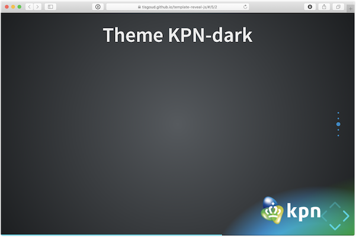

# template-reveal-js
Reveal.js template with menu- and verticator plugin and customised themes

[See it in action](https://tisgoud.github.io/template-reveal-js/)

## Features

- Menu (plugin)
- Vertical slides indicator (plugin)
- Slides in separate Markdown file
- Themes with logos
  - KPN, light and dark
  - DomoticaGrunn, light and dark
- Title needs to be set in 'index.html'

## Menu files

- menu-info.html:
  - titel,
  - when and where,
  - author and
  - links to the applications used
- menu-links.html:
  - links to the subjects from the presentation
- menu is activated with 'm'
- on-the-fly swapping themes

## Vertical slide indicator

The vertical slide indicator plugin displays the number of vertical slides.

The color of the indicator needs to be set for each theme in the file 'index.html'.

## Slides in separate Markdown file

Slides are stored in 'slides.md'.

Images used in the slides are placed in the directory 'images'.

## Themes

Custom themes with logos for KPN and DomoticaGrunn.

Images used in these themes are stored in the directory 'css>theme>images'.

Default theme is kpn-light and is set in 'index.html'.

### KPN-light

css/theme/kpn-light.css

### KPN-dark

css/theme/dg-dark.css

### DomoticaGrunn-light

css/theme/dg-light.css

### DomoticaGrunn-dark

css/theme/dg-dark.css