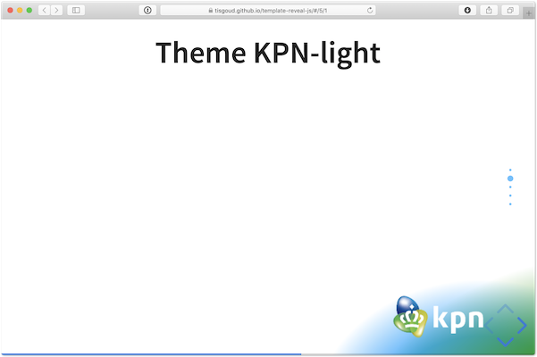
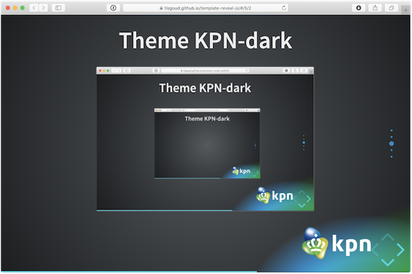
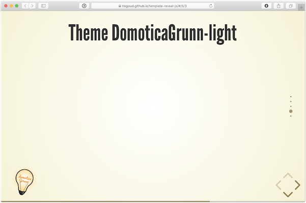
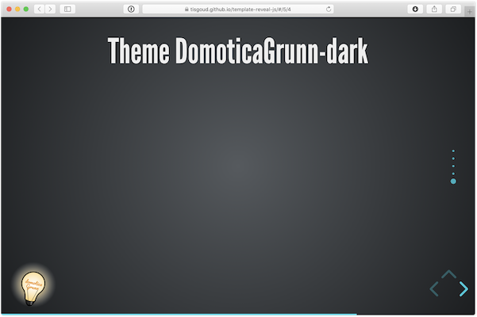

<!-- .slide: data-menu-title="Reveal.js template" data-background-image="images/background.png" data-background-opacity="0.5" -->
# Reveal.js template

---

<!-- .slide: data-menu-title="Features" -->
## Features

- Menu (plugin)
- Vertical slides indicator (plugin)
- Slides in separate Markdown file
- Themes with logos
  - KPN, light and dark
  - DomoticaGrunn, light and dark
- Title needs to be set in 'index.html'

---

<!-- .slide: data-menu-title="Menu files" -->
## Menu files

- menu-info.html:
  - titel,
  - when and where,
  - author and
  - links to the applications used
- menu-links.html:
  - links to the subjects from the presentation
- menu is activated with 'm'
- on-the-fly swapping themes

---

<!-- .slide: data-menu-title="Vertical slide indicator" -->
## Vertical slide indicator

The vertical slide indicator plugin displays the number of vertical slides.

The color of the indicator needs to be set for each theme in the file 'index.html'.

--

## One down

--

## Two down

--

### Three down

---

<!-- .slide: data-menu-title="Slides in separate Markdown file" -->
## Slides in separate Markdown file

Slides are stored in 'slides.md'.

Images used in the slides are placed in the directory 'images'.

---

<!-- .slide: data-menu-title="Themes" -->
## Themes

Custom themes with logos for KPN and DomoticaGrunn.

Images used in these themes are stored in the directory 'css>theme>images'.

Default theme is kpn-light and is set in 'index.html'.

--

<!-- .slide: data-menu-title="Theme KPN-light" -->
## Theme KPN-light

css/theme/kpn-light.css

--

<!-- .slide: data-menu-title="Theme KPN-dark" -->
## Theme KPN-dark

css/theme/dg-dark.css

--

<!-- .slide: data-menu-title="Theme DomoticaGrunn-light" -->
## Theme DomoticaGrunn-light

css/theme/dg-light.css

--

<!-- .slide: data-menu-title="Theme DomoticaGrunn-dark" -->
## Theme DomoticaGrunn-dark

css/theme/dg-dark.css

---

<!-- .slide: data-menu-title="Slide fragments" -->

## Slide fragments

- bullet 1 <!-- .element: class="fragment" data-fragment-index="1" -->
- bullet 2 <!-- .element: class="fragment" data-fragment-index="2" -->
- bullet 3 <!-- .element: class="fragment" data-fragment-index="3" -->

---

<!-- .slide: data-menu-title="Highlight color" -->
## Highlight color

- Bullet 1 with highlight color <!-- .element: class="fragment highlight-current-blue" data-fragment-index="1" -->

- Bullet 2 with highlight color <!-- .element: class="fragment highlight-current-blue" data-fragment-index="2" -->

---

<!-- .slide: data-menu-title="Images" -->
## Images

Images are displayed without borders or shadow

---

<!-- .slide: data-menu-title="That's all folks" data-background-image="images/Thats_all_Folks.jpg" data-background-opacity="1.0" -->
